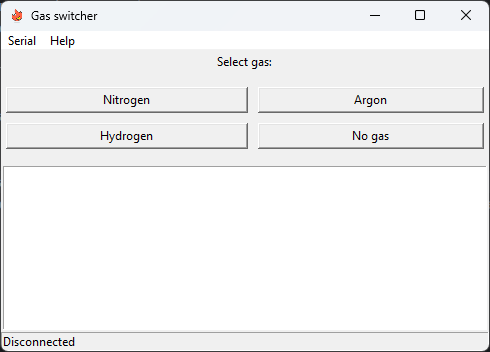

Application to change the Gas being injected in the linear device. Works by simply sending a serial command to the Arduino in the gas switch, which will change to the gas it receives in the serial command.

